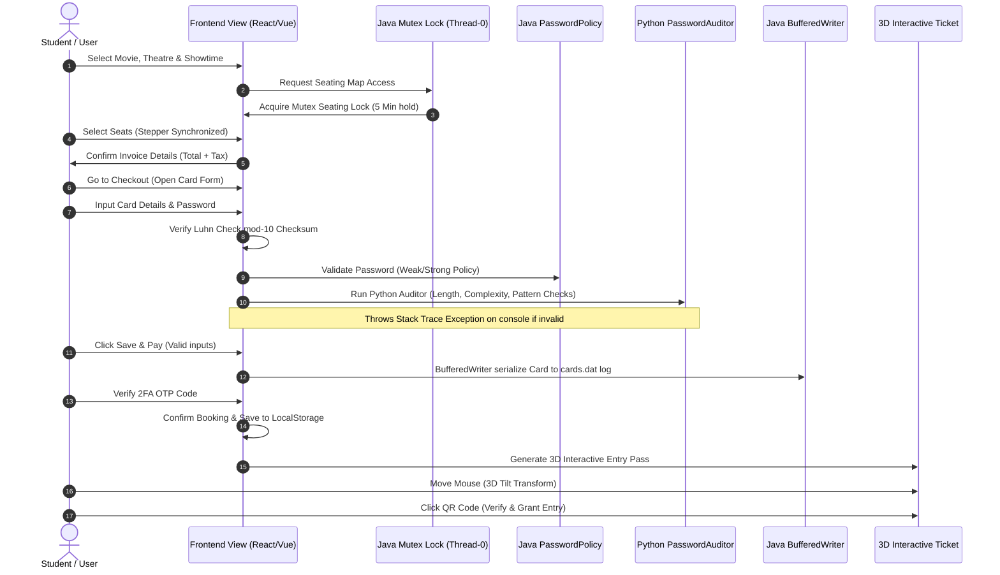

# Project Report: CineBook Ticketing & Security System
**End-to-End Implementation Summary (Coursework submission)**

This report compiles all front-to-back developments completed across the previous and current sessions of the **CineBook** project. It integrates React/Vue frontend UI patterns with simulated and actual Java & Python syllabus concepts.

---

## 1. User Interface & Layout (Apple HIG & District UI)
- **Host Architecture**: Built a React-based Single Page Application (SPA) using a custom `window.location.hash` router to handle pages without browser reloads.
- **Visual Aesthetic**: Implemented an OLED Deep Black backdrop with frosted glass panels (`backdrop-filter: blur(40px)`), system accent colors, and custom scrollbars.
- **Responsive Grids**: Setup CSS grid columns that adapt to mobile viewports for movie grids, theatres, showtime selections, and payment interfaces.

---

## 2. Interactive Seating & Mutex Thread Lock Simulation
- **Seat Map Matrix**: Implemented a curved glowing cinema projection screen and separate pricing segments (Premium vs. Classic rows).
- **Synchronized Stepper Logic**: Created bidirectional bindings between the **Seats to Select** stepper and the map:
  - Toggling seats updates the stepper quantity automatically.
  - Adjusting the stepper dynamically adds or removes adjacent seats.
  - Recommended seats select exactly `N` best available seats.
- **3D Selected Seat Flip**: Selected seats rotate in 3D to reveal the movie poster thumbnail.
- **Java Mutex Seating Hold**: A simulated thread `Thread-0` locks the seating layout during checkout, maintaining a 5-minute allocation hold while regularly printing database validation logs.

---

## 3. 3D Animated Tickets in My Bookings
- **3D Card perspective**: Added a tilt interaction on booking cards in [MyBookings.js](file:///D:/PROJECTS/WEB-DEV-VOC/NEWFINAL/src/pages/MyBookings.js) using CSS 3D transforms. Hovering causes the ticket to tilt dynamically relative to the cursor position.
- **Tear-Off Stub & Barcode**: Styled the ticket with notched borders, dotted tear lines, price stubs, and realistic barcode renderings.
- **Custom QR Code & Scan Simulation**: Developed an offline SVG QR code generator. Tapping the QR code simulates an entry scan, updating the ticket's color and showing a **Verified** badge.

---

## 4. Java Syllabus Integration
*   **Encapsulation & OOP**: Private attributes in card objects with simulated Java getters and setters ([Card.java](file:///D:/PROJECTS/WEB-DEV-VOC/NEWFINAL/java/src/Card.java)).
*   **ArrayList Collection Visualizer**: Renders a dynamic block diagram representing how cards are saved inside an `ArrayList<Card>` in the browser.
*   **BufferedWriter Simulator**: Logs disk writing operations (`FileWriter` / `BufferedWriter`) when credentials are saved.
*   **Live Exception Console**: Captures invalid inputs (checksum validation, date format, policy check failures) and throws simulated runtime exceptions (e.g. `IllegalArgumentException`) with full stack traces in the sidebar console.

---

## 5. Python Syllabus Integration
*   **Abstraction & Inheritance**: Re-implemented abstract base checks (`PasswordCheck`) and subclasses (`LengthCheck`, `ComplexityCheck`, `PatternCheck`) representing Python OOP logic.
*   **Python Shell Console Emulator**: Added an interactive command-line terminal on the password audit page that executes shell commands like `audit`, `stored`, and `generate`.
*   **Matplotlib.pyplot Simulator**: Formats password evaluation statistics into a bar chart on a canvas, allowing administrators to export the graph as a PNG.

---

## 6. Payment Screen & Usability Improvements
*   **Patterned Inputs**: Automatically formats card number inputs to `XXXX XXXX XXXX XXXX` and expiry dates to `MM/YY` as they are typed.
*   **Preset Chips**: Added click-to-fill chips for Visa, Mastercard, and RuPay that auto-populate valid Luhn-passing credentials and policy-compliant passwords.
*   **Flexible Default Policy**: Changed the default active policy to `WeakPolicy` to prevent users from being blocked by complex password requirements while testing.

---

## 7. Architecture Diagrams

### 7.1 System Component Architecture
This diagram outlines the CineBook Single Page Application structure and how the Java and Python syllabus concepts interface with the React/Vue frontend views:

```mermaid
graph TD
    subgraph Frontend_Client [React SPA Host]
        Navbar[Navbar Component]
        Router[Hash Router]
        Context[Booking Context State]
        
        subgraph Pages [Pages & Modules]
            Home[Home / Movies List]
            Detail[Movie Detail & Showtime Picker]
            Booking[Booking Page / Seating Map]
            Confirm[Confirm Page / Invoice]
            Payment[Payment Selection]
            VueForm[Vue CardForm Bridge]
            Otp[OTP Verification Page]
            Success[PaymentDone / Success Screen]
            Bookings[My Bookings & 3D Ticket Pass]
            PythonPage[Python Password Audit Center]
        end
    end

    subgraph Java_Syllabus_Layer [Java Security & Payment Integration]
        CardMgr[CardManager & ArrayList Store]
        Policy[PasswordPolicy - Abstraction]
        WeakPol[WeakPolicy / StrongPolicy - Polymorphism]
        FileIO[BufferedWriter / FileWriter Logs]
        Mutex[Thread Mutex Concurrency Lock]
        Exc[Exception Stack Trace Console]
    end

    subgraph Python_Syllabus_Layer [Python OOP & Audit Integration]
        Audit[PasswordAuditor ABC checks]
        LenCheck[LengthCheck / ComplexityCheck]
        Shell[Python Shell Simulator]
        Matplotlib[Matplotlib Canvas Plot Exporter]
    end

    %% Connections
    Router --> Home
    Router --> Detail
    Router --> Booking
    Router --> Confirm
    Router --> Payment
    Router --> VueForm
    Router --> Otp
    Router --> Success
    Router --> Bookings
    Router --> PythonPage

    Booking <--> Context
    Booking --> Mutex
    VueForm --> CardMgr
    VueForm --> Policy
    VueForm --> FileIO
    VueForm --> Exc
    Bookings --> Success
    PythonPage --> Audit
    PythonPage --> Shell
    PythonPage --> Matplotlib
```

### 7.2 End-to-End Booking & Validation Sequence Flow
This sequence flow represents the chronological order of data checking, multi-language validation, and file recording during a booking:

