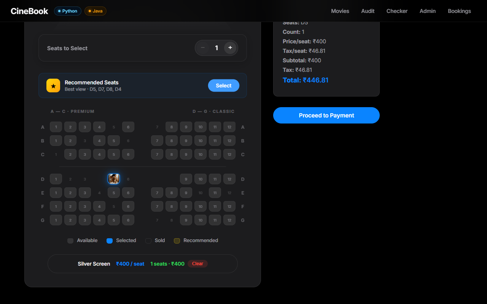
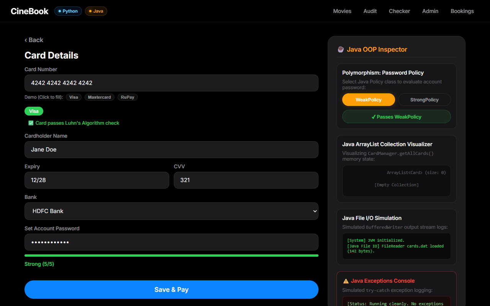
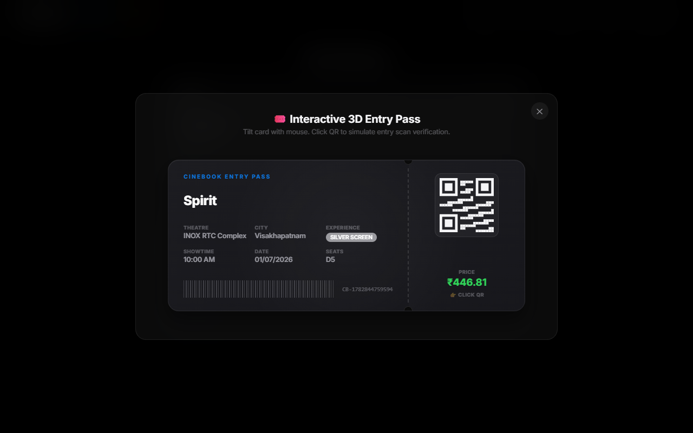
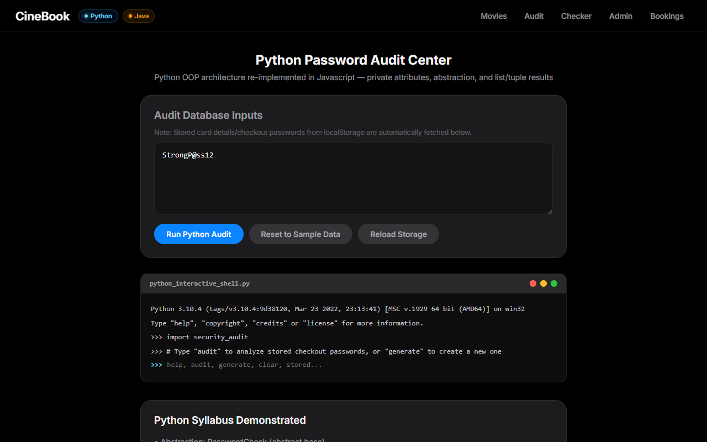
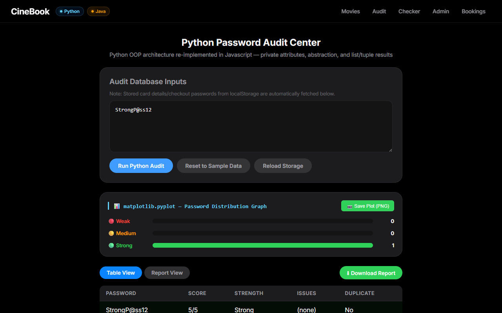

# 🎬 CineBook Pro
### An Integrated Multi-Language Movie Ticketing & Security Architecture

<p align="center">
  <a href="https://chatur7x.github.io/CineProo/">
    
  </a>
  
  
  
  
</p>

---

## 🌐 Live Demo & Interactive Presentation
* **🚀 Production App Deploy:** [https://chatur7x.github.io/CineProo/](https://chatur7x.github.io/CineProo/)
* **📊 Modern HTML Presentation:** [https://chatur7x.github.io/CineProo/presentation.html](https://chatur7x.github.io/CineProo/presentation.html)

---

## 📝 Table of Contents
1. [Overview](#-overview)
2. [Visual Tour & Screenshots](#-visual-tour--screenshots)
3. [Technology Stack](#-technology-stack)
4. [Architecture Blueprint](#-architecture-blueprint)
5. [Key Feature Implementations](#-key-feature-implementations)
   - [React-Vue Interoperability](#1-react-vue-interoperability)
   - [Java Security & Concurrency Engine](#2-java-security--concurrency-engine)
   - [Python Password Auditing Layer](#3-python-password-auditing-layer)
6. [AI & Prompt Engineering Workflow](#-ai--prompt-engineering-workflow)
7. [Local Setup & Running Guide](#-local-setup--running-guide)
8. [GitHub Pages Deployment Setup](#-github-pages-deployment-setup)
9. [Student Profile](#-student-profile)

---

## 📋 Overview

**CineBook Pro** is a high-performance cinema ticketing application built during the **CareerX Training & Internship Program** at **Vault of Codes** (held from *May 15 to June 15*). 

Rather than a simple single-language application, this project is architected as a **hybrid multi-language framework simulation** designed to demonstrate advanced software engineering principles:
* **Frontend:** A component-driven, responsive React Single-Page Application hosting embedded, reactive Vue.js widgets.
* **Java Core:** A dedicated security layer executing credit card validation, OOP encapsulation, memory tracking, and file I/O operations.
* **Python Core:** A password strength audit console derived from abstract classes, using Matplotlib to plot statistics.
* **AI & Prompt Engineering:** Advanced AI prompts were used to accelerate debugging, model complex calculations, and refine the user experience.

---

## 📸 Visual Tour & Screenshots

Here is the step-by-step transaction flow inside the application interface:

| 1. Home Dashboard | 2. 3D Seating Map |
| :---: | :---: |
|  |  |
| Frosted-glass movie cards with filters | Dynamic seat selection with recommended paths |
| **3. Vue Checkout & Luhn Validation** | **4. Parallax 3D Ticket Pass** |
| :---: | :---: |
|  |  |
| Real-time formatting & card type presets | Tilt-responsive ticket with SVG QR scanning |
| **5. Python Password Audit** | **6. Audit Chart Visualization** |
| :---: | :---: |
|  |  |
| Embedded CLI terminal simulation | Matplotlib vulnerability bar graph |

---

## 🛠️ Technology Stack

| Track | Component | Technologies | Implementation Scope |
|---|---|---|---|
| **Web Dev** | Frontend Host | React 18, HTML5, CSS3, JavaScript (ES6+) | Hash routing, global context state, frosted-glass CSS, 3D CSS transforms |
| **Web Dev** | Embedded Widgets | Vue.js 3 | Card forms, real-time input masking, password auditing consoles |
| **Java** | Security Logic | Java JDK | Luhn Algorithm, Encapsulation, ArrayList collections, BufferedWriter logs |
| **Python** | Audit Logic | Python 3, Matplotlib, Regex | Abstract Base Classes, password strength scoring, stats visualization |
| **AI** | Development Helper | Prompt Engineering | Prompt chaining, Zero/Few-shot prompts for debugging and lock simulations |

---

## 🏗️ Architecture Blueprint

The application divides responsibilities into separate layers to isolate UI layout, validation algorithms, and disk logging:

```
                  ┌─────────────────────────────────────────┐
                  │          Frontend Client Layer          │
                  │   React 18 SPA  ←→  Vue 3 Containers    │
                  │  (Hash Router, Context, 3D Transforms)  │
                  └────────────────────┬────────────────────┘
                                       │
                                       ▼
                  ┌─────────────────────────────────────────┐
                  │           Java Security Layer           │
                  │   • Card Validity (Luhn Check)          │
                  │   • Encapsulated OOP Card Models        │
                  │   • BufferedWriter Transaction Logs      │
                  │   • Thread-0 Mutex Seat Reservation     │
                  └─────────────────────────────────────────┘
                                       │
                                       ▼
                  ┌─────────────────────────────────────────┐
                  │           Python Audit Layer            │
                  │   • Abstract PasswordCheck Base        │
                  │   • Concrete Rule Regex Evaluations     │
                  │   • Matplotlib Stats Graph Rendering    │
                  └────────────────────┬────────────────────┘
                                       │
                                       ▼
                  ┌─────────────────────────────────────────┐
                  │             Storage Layer               │
                  │   • Browser LocalStorage (Bookings)     │
                  │   • cards.dat Disk Logging File         │
                  └─────────────────────────────────────────┘
```

---

## ⚙️ Key Feature Implementations

### 1. React-Vue Interoperability
To satisfy the multi-framework syllabus requirements, custom Vue.js applications are mounted directly inside React DOM ref elements.
* **Mounting Pattern:**
  ```javascript
  // React container mounts the Vue app
  const VueCardWrapper = () => {
    const vueRef = useRef(null);
    useEffect(() => {
      const app = createApp(CardCheckoutForm);
      app.mount(vueRef.current);
      return () => app.unmount(); // Prevent memory leaks
    }, []);
    return <div ref={vueRef} className="vue-wrapper-container" />;
  };
  ```
* **State Bridge:** Communication is bridged using custom browser event dispatches (`window.dispatchEvent`) syncing items like ticket quantity and total billing.

### 2. Java Security & Concurrency Engine
Simulates native backend processes in Java:
* **Luhn Check Algorithm:** Prevents card entry fraud by running a mod-10 double-every-second digit sum check.
* **Encapsulation:** Privately declares card numbers, exposing them only through checked getter and setter methods.
* **Mutex Reservation:** Thread-0 spawns a simulated lock when seats are clicked. A synchronized block holds coordinates for 5 minutes to prevent race conditions.
* **File Logging:** Uses `BufferedWriter` and `FileWriter` to output transaction receipts to `cards.dat` on disk.

### 3. Python Password Auditing Layer
Demonstrates Object-Oriented Inheritance and Abstraction:
* **ABC Structure:**
  ```python
  from abc import ABC, abstractmethod

  class PasswordCheck(ABC):
      @abstractmethod
      def validate(self, pwd: str) -> bool:
          pass

  class ComplexityCheck(PasswordCheck):
      def validate(self, pwd: str) -> bool:
          # Must contain uppercase, digit, and special characters
          return bool(re.search(r'[A-Z]', pwd) and re.search(r'\d', pwd))
  ```
* **Stats Plotting:** Generates vulnerability rating bars using Matplotlib, outputting images rendered inside the browser's terminal screen.

---

## 🧠 AI & Prompt Engineering Workflow

During development, prompt engineering was systematically used to write code, debug issues, and format reports:
* **Zero-Shot Prompting:** Used to draft basic algorithms such as Luhn's checksum structure and regex constraints.
* **Few-Shot Prompting:** Used to structure test datasets (mock movie shows, credit card numbers passing/failing Luhn checks) to ensure validation coverage.
* **Chain-of-Thought (CoT) Prompting:** Used to resolve complex race conditions inside the seat reservation module, leading to the creation of the Java Mutex Lock simulation.

---

## 💻 Local Setup & Running Guide

Since the application is compiled as a static client-side single-page app, setting it up is simple:

1. **Clone the repository:**
   ```bash
   git clone https://github.com/Chatur7x/CineProo.git
   cd CineProo
   ```
2. **Launch the application:**
   * Simply double-click the `index.html` file in your file explorer to run it directly in any browser.
   * Or run a local development server in VS Code using the **Live Server** extension.
3. **View the Presentation:**
   * Open `presentation.html` in your browser.
   * Press `F11` for full screen and navigate using your arrow keys.

---

## ⚙️ GitHub Pages Deployment Setup

This project uses a custom GitHub Actions workflow to auto-build and deploy:
1. Go to **Settings > Pages** on your GitHub repository.
2. Under **Build and deployment > Source**, select **GitHub Actions**.
3. Every commit pushed to `main` will automatically compile and update your live site!

---

## 👤 Student Profile

* **Name:** Kolluri Chaturvedhi Narsimha
* **Roll Number:** 24EG109A28
* **Department:** Computer Science & Engineering (Cyber Security)
* **Institution:** Anurag University, Venkatapur, Hyderabad
* **Internship Provider:** Vault of Codes (CareerX Program)
